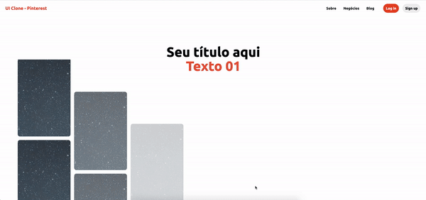

 
  

  &#xa0;

  <!-- <a href="https://clonepinterest.netlify.app">Demo</a> -->

<h1 align="center">Clone Pinterest</h1>

  

  

  

  <!--  ->

  <!--  -->

  <!--  -->

  <!--  -->

<!-- Status -->

<!-- <h4 align="center"> 
	🚧  Clone Pinterest 🚀 Under construction...  🚧
</h4> 

 -->

  <a href="#dart-about">About</a> &#xa0; | &#xa0;
  <a href="#rocket-technologies">Technologies</a> &#xa0; | &#xa0;
  <a href="#memo-license">License</a> &#xa0; | &#xa0;
  <a href="https://github.com/fabramosdev" target="_blank">Author</a>

 

## :dart: About ##

Projeto de estudos recriando o efeito da página inicial do Pinterest.

## :rocket: Technologies ##

O que foi usado no projeto?

- [HTML]
- [SASS]
- [JAVASCRIPT]

## :rocket: Original ##

## :rocket: Clone ##

## :memo: License ##

This project is under license from MIT. For more details, see the [LICENSE](LICENSE.md) file.

Made with :heart: by <a href="https://github.com/fabramosdev" target="_blank">Fabiano Ramos</a>

&#xa0;

<a href="#top">Back to top</a>
